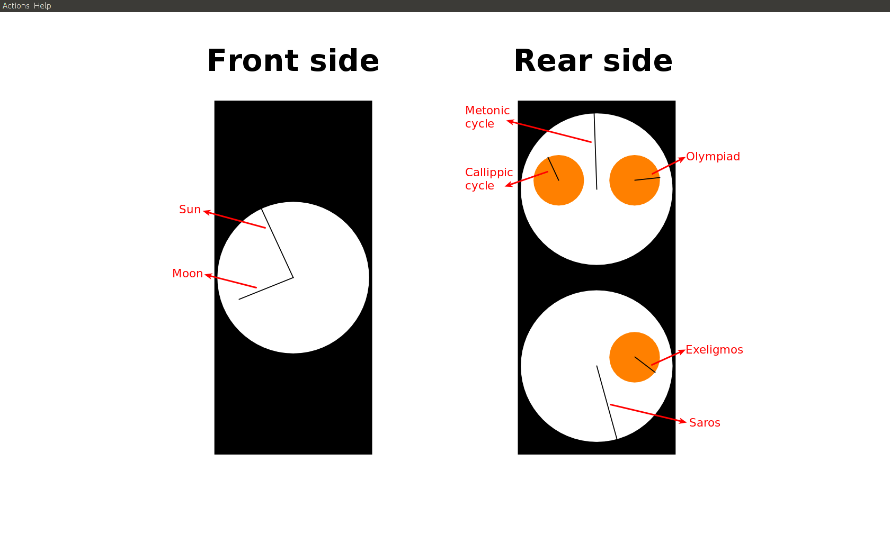

## Antikythera Mechanism Simulation

This is a simple, minimalistic simulation of the [Antikythera Mechanism's](https://en.wikipedia.org/wiki/Antikythera_mechanism)
main functions. It was created as part of a school project on the Mechanism.

Requires Java >= 6.
